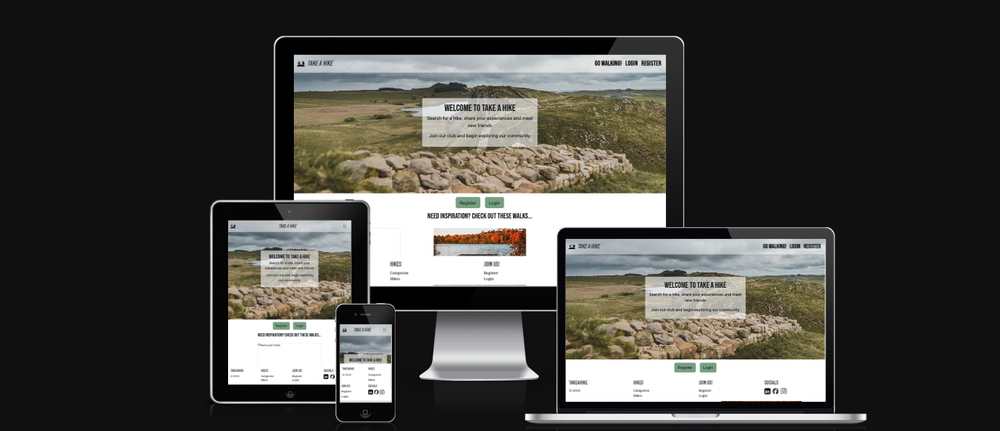
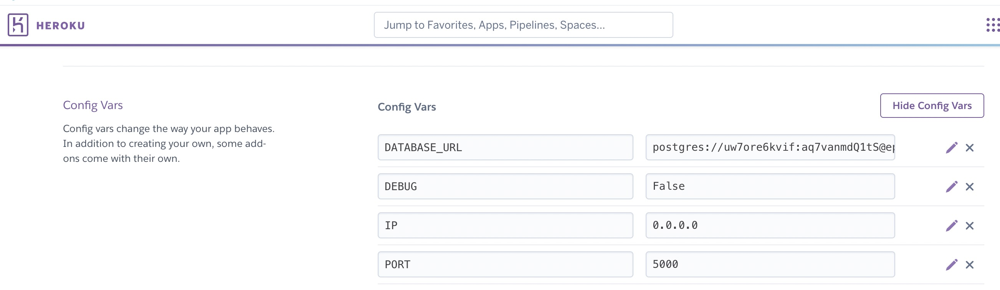

<h1 align="center">Trailfinders</h1>

- - - 

<h2 align="center"></h2>

# Trailfinders

This project was designed for Milestone Project 3 of Code Institutes' Level 5 Diploma in Web Development.

Trailfinders is for all those who love being outdoors and exploring the beauty in their local area. It allows the user to view Hikes within the North East of England that have been added by other users, add their own hikes and hopefully inspire more people to get outdoors and start exploring! The website offers users a platform to share their thoughts and opinions on the hikes posted and in doing so brings a community of people together.  

This website has been built using HTML, CSS, Javascript and Python.

[View the live project here.](https://trailfinders-710f937aa94a.herokuapp.com/)

## Contents

* [Languages Used](#languages-used)
* [User-Experience-Design]
    * [User Stories](#user-stories)
* [Design](#design)
  * [Color Scheme](#color-scheme)
  * [Typography](#typography)
  * [Imagery](#imagery)
  * [Wireframes](#wireframes)
  * [Database Schema](#database-schema)
* [Structure](#design)
  * [Features](#features)
  * [Features For Future Implementation](#features-for-future-implementation)
* [Technologies Used](#technologies-used)
  * [ Frameworks, Libraries & Programs Used](#frameworks-libraries--programs-used)
* [Deployment](#deployment)
  * [Version Control](#version-control)
  * [Run locally](#run-locally)
* [Credits](#credits)
* [Acknowledgements](#acknowledgements)

- - - 

## Languages Used

*  [HTML5](https://en.wikipedia.org/wiki/HTML5)
*  [CSS3](https://en.wikipedia.org/wiki/Cascading_Style_Sheets)
*  [JS](https://en.wikipedia.org/wiki/JavaScript)

- - - 

## User-Experience-Design

-   ### User stories

    -   #### First Time User Goals

        1. As a first time user, I want to be able to easily navigate around the site without any errors and without the use of the back arrow in the browser.
        2. As a first time user, i want to easily understand the purpose of the site
        3. As a first time user, I want to be able to search for a hike route.
        4. As a first time user, I want to be able to view details about the chosen route and see what other users thoughts/recommendations are.
        5. As a first time user, I want to be able to register on the site to get full access 
        6. As a first time user, I want to be able to quickly login to the site each time I visit.
        7. As a first time user, I want to be able to see the hikes that i have posted.
        8. As a first time user, I want to be able to edit or delete my hikes, if I want to.
        
    
    -   #### Returning User Goals

        1. As a returning user, I want to be able to easily log into the site to view my profile.
        2. As a returning user, I want to be abe to keep up-to-date on other users' hikes and comments so that i can stay involved within the community.
        3. As a returning user, I want to be able to continue to add, edit or delete my hikes.
        4. As a returning user, I want to find that any new added information follows the design and flow of the website and is easy to access.

    -   #### Site Administrator

        1. As the site administrator, I want the user to be able to register and login without any difficulty or error.
        2. As the site administrator, I want to ensure a user is only able to edit or delete their own posts.
        3. As the site administrator, I want to ensure the user is able to navigate around the site without raising any errors.
        4. As the site administrator, I want to ensure that if any errors occur, they are handled gracefully and the user is shown quickly back to the website.
        5. As the site administrator, I want to ensure user information is handled securely.
        6. As the site administrator, I want to know that any future site developments can easily be adapted/added to the site.

- - - 

## Design

-   ### Colour Scheme

    * Northern Trailfinders aims to help the user explore and enjoy the stunning countryside, specifically in the North East of England. 
    * The themes of the site are nature, relaxation, exploration and enjoying exercising outdoors. 
    * The colour palette was chosen for its calm and earthy tones. It was also important to make sure there was enough contrast within the palette to ensure no issues with accessibility.

-   ### Typography

    * Noto Sans was the font chosen for the site.
    * This font is clean, clear and easy to read online. 
    <link rel="preconnect" href="https://fonts.googleapis.com">
<link rel="preconnect" href="https://fonts.gstatic.com" crossorigin>
<link href="https://fonts.googleapis.com/css2?family=Noto+Sans:ital,wght@0,100..900;1,100..900&display=swap" rel="stylesheet">

-   ### Imagery
    * Imagery has been kindly provided by Adam Lowes with consent.

-   ### Wireframes

    * Home Page (desktop) Wireframe - [Balsamiq wireframe]()
    * Home Page (mobile device) Wireframe - [Balsamiq Home Page (mobile device) wireframe]()
    * Wireframe - [Balsamiq  wireframe]()
    * Wireframe - [Balsamiq wireframe]()
    * Wireframe (desktop)- [Balsamiq wireframe]()
    * Wireframe (mobile device) - [Balsamiq (mobile device)]()
    * Wireframe - [Balsamiq wireframe]()

-   ### Database Schema
    * [EDR diagram](trailfinders/static/media/testing_images/EDR.png)
- - - 

## Structure

-   ### Features
    * Responsive on device sizes with media screen size >280px

    -   #### Navigation Bar
        * The navigation bar contains the site logo and title alongside links to other pages.
        * The navbar is visible when the user lands on each page but disappears whlst the user scrolls down. As the user scrolls up, it reappears so that the user can use the navigation links if they wish. This is done using javascript. The purpose is to give the user maximum view of the page contents whilst it alway being easily accessible to the user.
        * The navbar also has some transparency so that the hero image can be seen beneath it to some degree, this was a design choice so that the navbar doesn't block the imagery.

       

       * The responsive navbar features a hamburger menu on medium sized devices and smaller

       

       

    -   #### Background Image
        * The hero image was kindly donated from photographer Mr Adam Lowes for specific use on this site. It is an image of the famous Hadrians Wall. This was chosen as it is part of an iconic walk in the North East of England, where trailfinders is set.
        * The hero image features on most pages where it adds value to the user. It was felt that the Hike and add hike pages were quite full of content as posts were added and a hero image detracted form this content rather than lifting it.
        
        

    -   #### Home page
        
        

    -   #### Login

        

    -    #### Register

        

    -    #### Categories
         
         

    -    #### Add Category
         
         

    -    #### Edit Category
          
         

    -    #### Hikes
          * Displays Hikes from all users. Buttons to edit or delete posts are only visible to the user who created the post. 
         

    -    #### Add Hike
         * Features a form for the user to complete. Once the details are filled in correctly, including those with 'required' fields, the user can press the form buttton and will be redirected to the Hikes page where their post will be visible. 
         

    -    #### Edit Hike
         *  Shows the same form format to the user with prepopulated data so the user can be reminded what they have written. They are free to ammend the input and can press the form button. They are redirected to the Hikes pages where they will be able to see their updates post.
         

    -    #### Footer
         * Responsive. Features the site Title, links to the main pages and social links.
         
         

    -    #### 404 Error Page
          * A 404 error page was created to ensure that if, for any reason, the webpage is unavailable, the user is taken to a message page which helps to redirect them back to the website.

         

    -    #### 500 Error Page
         * A 500 error page was created to ensure that if, for any reason, there is an internal server error, the user is taken to a message page which helps to redirect them back to the website.
         

-   ### Features For Future Implementation
    *  Asking users to input an image url when adding/editing their hike posts may feel cumbersome to the user and make it less likely that this field is filled in, affecting UX and also the aesthetic of the site. It would be beneficial to connect to any API that would already have a large range of images for the user to search and select rather than having to search for the images themselves and input. 
    * A star rating system or a thumbs up/'favourited' and comments feature would be an interesting feature to add to the hike posts so that users could interact with others' posts and this may increase engagement and build more of a sense of community within the site.
    * It would be a good idea to have a Profile page for the user to see their own hikes and perhaps a section for their 'favourited' hikes that they have seen posted by other users so that users can keep track of where they have walked and where they would like to walk in the future. This would improve user experience and the personalisation of a profile page would mean they are more likely to return to the site.
    * I would like to implement an administrator login/role within the login functionality so that the site administartor has some control in the running of the site if required. 
    
- - - 

## Technologies Used

-   ### Frameworks, Libraries & Programs Used

    * [Google Fonts](https://fonts.google.com/) were used to import the 'Bebas Neue' and 'Noto Serif' font into the style.css file which is used on all pages throughout the project. 
    * [Bootstrap v5.3.2]() was used on all pages throughout the website to add icons for aesthetic and UX purposes
    * Gitpod was the IDE used to build the project. Git was used for version control.
    * [GitHub](https://github.com/) is used to store the projects code after being pushed from Git.
    * [Balsamiq](https://balsamiq.com/) was used to create the wireframes to support in the design process.
    * [Jinja](https://jinja.palletsprojects.com/en/3.1.x/) - templating engine
    * [Pip](https://pypi.org/project/pip/) - tool for installing python packages
    * [Lucid Chart](https://lucid.app/lucidchart/c05f73cc-9dcc-4449-bd72-3098abe54692/edit?invitationId=inv_1c31fd92-4378-45d3-93c0-a252029cd87d&page=0_0#) was used to design the EDR model when planning the database
    * The site was deployed using Heroku and the database used alongside this was PostgreSQL fro Code Institute
    * [Shields.io](https://shields.io/badges) was used for the shields used within the Readme
    * [Favicon.io](https://favicon.io/) was used to design the favicon for the site
    * [Chrome Developer Tools](https://developer.chrome.com/docs/devtools) was used throughout, to troubleshoot, solve bugs, test site features and responsiveness
    * [amiresponsive](https://ui.dev/amiresponsive) was used to create the responsive screen imagery for the site

- - - 
## Deployment

   ### Version Control

   ### Deployment
To deploy Trailfinders to Heroku, take the following steps:
1. Create a requirements.txt file using the terminal command `pip freeze > requirements.txt`
2. Create a Procfile with the terminal command `echo web: python app.py > Procfile`
3. `git add` and `git commit` these changes and `git push` to GitHub
4. Go to the Heroku website and create a new app by clicking the "New" button in your dashboard.
5. Give the app and name and set the region to Eurpoe
6. From the heroku dashboard of the new app, click on "Deploy" > "Deployment method" and select Github
7. Confirm the link to the correct GitHub repository
8. In the heroku dashboard for the application. click on the "settings" > "Reveal Config Vars"
9. Set the following Config Vars:

* to get the db url follow [CI PosgreSQL](https://dbs.ci-dbs.net/)
10. In the Heroku dashboard, click "Deploy"
11. In the "Manual Deployment" section, ensure the master branch is selected then click "Deploy Branch"
11. The site is now deployed

-   ### Run locally

**Fork**
1. Login or Sign Up to GitHub.
2. Open the project [Repository](https://github.com/Code-Institute-Org/ci-full-template.git).
3. Click the Fork button in the top right corner.

**Clone**
1. Login or Sign Up to GitHub.
2. Open the project [Repository](https://github.com/Code-Institute-Org/ci-full-template.git).
3. Click on the code button, select whether you would like to clone with HTTPS, SSH or GitHub CLI and copy the link shown.
4. Open the terminal in the code editor of your choice and change the current working directory to the location you want to use for the cloned directory.
5. Type 'git clone' into the terminal and then paste the link you copied in step 3. Press enter.

- - - 

## Credits

   ### Content

- Code Institute was used throughout for guidance but in particular for assistance when building the CRUD functionality within the project.

- For guidance relating to the login and register functionality the following resources were utilised: [The Code City](https://www.youtube.com/watch?v=lAY7nXh83fI) and [Geeks for Geeks](https://www.geeksforgeeks.org/how-to-add-authentication-to-your-app-with-flask-login/?ref=previous_article)

- For guidance when creating a responsive navbar [Stack Overflow](https://stackoverflow.com/questions/36317334/bootstrap-footer-links-full-width-and-two-column-on-mobile), (https://stackoverflow.com/questions/15591620/how-to-retrieve-session-data-with-flask) for information on how to retrieve session data using flask and (https://stackoverflow.com/questions/6750017/how-to-query-database-by-id-using-sqlalchemy) refressher on how to query the datatbase

- [Codemy](https://www.youtube.com/watch?v=WqHtmz8Ibn8&list=PLCC34OHNcOtolz2Vd9ZSeSXWc8Bq23yEz&index=34) flask series was used for assistance further understanding jinja templating. Particularly assisted with login functionality.

- [SheCodes](https://www.shecodes.io/athena/7982-how-to-make-a-nav-bar-show-on-scroll-up-disappear-on-scroll-down#:~:text=in%207.4%20seconds-,To%20make%20a%20nav%20bar%20menu%20show%20on%20scrolling%20upward,can%20use%20JavaScript%20and%20CSS.&text=js-,window.,you%20can%20check%20the%20window. Nabber) helped me to understand navbar scroll behaviour and also as inspiration for button design later in the project. For design improvements on the site, I wanted the navbar to disappear when the user scrolls down and reappear when scrolling up. I utilised .hide and .show within the css and added a domcontent loaded to the js file. 

- [Stack Exchange](https://cs50.stackexchange.com/questions/27648/how-to-get-a-value-using-flask-from-a-selected-option-in-a-drop-down-list) provided valuable information regarding flask and form input.

- [W3Schools](https://www.w3schools.com/html/html_form_elements.asp) for refresher on form styling within html/css.

- [TableMagic](https://stevecat.net/table-magic/) for creating the testing table

- [GeeksforGeeks](https://www.geeksforgeeks.org/python-404-error-handling-in-flask/)

- Content was written by Chloe Livingstone-Evans.

- - - - 

   ### Media Images

- Credits for media images goes to Mr Adam Lowes, who kindly offered his own stunning photography in use wihtin this project.

- The favicon in the browser tab was created using[Favicon](https://favicon.io/logo-generator/) and instruction on implementation from [Dee Mc](https://www.youtube.com/watch?v=W809I-d9xTg&t=8s) and [Geeks for Geeks](https://www.geeksforgeeks.org/how-to-add-authentication-to-your-app-with-flask-login/?ref=previous_article)

- [Online Converter](https://www.freeconvert.com/image-converter/download) and [Cloud Convert](https://cloudconvert.com/jpg-to-webp) were utilised to convert images to next generation format. [Image Resizer](https://imageresizer.com/resize/download/66471297c607d3969b115c0e ) was used to resize images, both to improve accessibility to site.

- - - 

## Acknowledgements

-  My family for their patience whilst I enjoyed myself coding.
-  My brilliant mentor Daisy McGee, for her excellent advice, patience and passion for teaching.