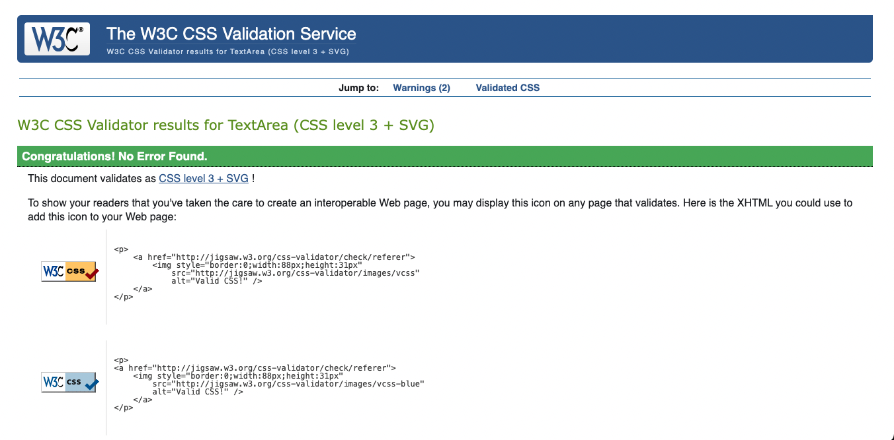

<h1 align="center">Northern Trailfinders</h1>

- - - 

<h2 align="center"></h2>

# Trailfinders

This project was designed for Milestone Project 3 of Code Institutes' Level 5 Diploma in Web Development.

Trailfinders is for all those who love being outdoors and exploring the beauty in their local area. It allows the user to search the North East of England for different hikes, add their own hikes and hopefully inspire more people to get outdoors and start exploring! The website offers users a platform to share their thoughts and opinions on the hikes posted and in doing so brings a community of people together. 

## Contents
* [Testing](#testing)
  * [User Experience](#user-experience-ux)
  * [Testing Site Functionality](#testing-site-functionality)
  * [Further Testing](#further-testing)
  * [Fixed Bugs](#fixed-bugs)
  * [Accessibility](#accessibility)

## Testing

-   ### Testing User Stories from User Experience (UX) Section

    -   #### First Time User Goals
        * 
            1. 

        * As a first time user, 
            1. 

        * As a first time user, 
            1. 

        * As a first time user, 
            1. 

        * As a first time user, 
            1. 

        * As a first time user, 
            1. 

        * As a first time user, 
            1. 

    -   #### Returning User
        * As a returning user, 
            1. 

        * As a returning user, 
            1. 

        * As a returning user, 
            1. 

        * As a returning user, 
            1.  

    -   #### Site Administrator

        * As a site administrator, 
            1. 

        * As a site administrator, 
            1. 

- - - 
-   ### Testing site functionality
| Feature                                                                                       | Expected Outcome                                                                                                        | Testing Performed                                                                                       | Result                                                                                       | Pass/Fail |
|-----------------------------------------------------------------------------------------------|-------------------------------------------------------------------------------------------------------------------------|---------------------------------------------------------------------------------------------------------|----------------------------------------------------------------------------------------------|-----------|
| NAVBAR                                                                                        |                                                                                                                         |                                                                                                         |                                                                                              |           |
| Title                                                                                         | Take user to Go Walking!(index.html) when clicked                                                                       | Clicked Title                                                                                           | Taken to Go Walking! page                                                                    | PASS      |
| Login link                                                                                    | Take user to the Login page                                                                                             | Clicked Login                                                                                           | Taken to Login page                                                                          | PASS      |
| Register link                                                                                 | Take user to the Register page                                                                                          | Clicked Register                                                                                        | Taken to Register page                                                                       | PASS      |
| (once user has successfully logged in)                                                        |                                                                                                                         |                                                                                                         |                                                                                              |           |
| Hikes link                                                                                    | Take user to the Hikes page                                                                                             | Clicked Hikes                                                                                           | Taken to Hikes page                                                                          | PASS      |
| Categories link                                                                               | Take user to the Categories page                                                                                        | Clicked Categories                                                                                      | Taken to Categories page                                                                     | PASS      |
| Logout link                                                                                   | Logs user out of the site. Renders Go Walking!(index.html),Navbar links show Go walking!, login and Register links only | Clicked Logout                                                                                          | Taken to Go walking!(index.html) and Navbar displays only Go Walking!, Login, Register links | PASS      |
| FOOTER                                                                                        |                                                                                                                         |                                                                                                         |                                                                                              |           |
| Categories link                                                                               | Take user to the Categories page                                                                                        | Clicked Categories                                                                                      | Taken to Categories                                                                          | PASS      |
| Hikes link                                                                                    | Take user to the Hike page                                                                                              | Clicked Hikes                                                                                           | Taken to Hikes page                                                                          | PASS      |
| Login link                                                                                    | Take user to the Login page                                                                                             | Clicked Login                                                                                           | Taken to Login page                                                                          | PASS      |
| Register link                                                                                 | Take user to the Register page                                                                                          | Clicked Register                                                                                        | Taken to Register page                                                                       | PASS      |
| LinkedIn icon                                                                                 | Take user to the sites LinkedIn page                                                                                    | Clicked LinkedIn icon                                                                                   | Taken to LinkedIn site                                                                       | PASS      |
| Facebook icon                                                                                 | Take user to the sites Facebook page                                                                                    | Clicked Facebook icon                                                                                   | Taken to Facebook site                                                                       | PASS      |
| Instagram icon                                                                                | Take user to the sites Instagram page                                                                                   | Clicked Instagram icon                                                                                  | Taken to Instagram site                                                                      | PASS      |
| GO WALKING! (index.html)                                                                      |                                                                                                                         |                                                                                                         |                                                                                              |           |
| Register button                                                                               | Take user to the Register page                                                                                          | Clicked Register button                                                                                 | Taken to Register page                                                                       | PASS      |
| Login button                                                                                  | Take user to the Login page                                                                                             | Clicked Login button                                                                                    | Taken to Login page                                                                          | PASS      |
| (if the session user is the creator of the hike post, Edit and Delete buttons are displayed)) |                                                                                                                         |                                                                                                         |                                                                                              |           |
| Edit button                                                                                   | Take user to Edit Hike page                                                                                             | Clicked Edit button                                                                                     | Taken to Edit Hike page                                                                      | PASS      |
| Delete button                                                                                 | Deletes post                                                                                                            | Clicked Delete button                                                                                   | Deletes post                                                                                 | PASS      |
| REGISTER                                                                                      |                                                                                                                         |                                                                                                         |                                                                                              |           |
| Register button                                                                               | Register user details, takes user to Login page to login. Flash message displayed.                                      | Input fields completed correctly and clicked Register                                                   | Taken to Login page, flash message "Fantastic! You're now registered, please login"          | PASS      |
| Login button                                                                                  | Takes user to login page                                                                                                | Clicked Login button                                                                                    | Taken to Login page                                                                          | PASS      |
| Close button on Flash message                                                                 | Closes the flash message                                                                                                | Clicked the 'X'                                                                                         | Flash message no longer on display                                                           | PASS      |
| Register button (if username and password but no email)                                       | Stays on Register page. Email input message tells user to 'Please fill in this field'                                   | Clicked Register button (leaving email input blank)                                                     | Stays on Register page, message telling user to complete email field                         | PASS      |
| Register button (if username and email but no password)                                       | Stays on Register page. Password input message tells user to 'Please fill in this field'                                | Clicked Register button (leaving password input blank)                                                  | Stays on Register page, message telling user to complete password field                      | PASS      |
| Register button (if password and email but no username)                                       | Stays on Register page. Username input message tells user to 'Please fill in this field'                                | Clicked Register button (leaving username input blank)                                                  | Stays on Register page, message telling user to complete Username field                      | PASS      |
| Register button (inputting username that has already been registered)                         | Stays on Register page. Flashed message to indicate to user that the username already exists                            | Clicked Register button (using input details where the username has already been registered)            | Stays on Register page, flashed message telling user 'This username already exists'          | PASS      |
| LOGIN                                                                                         |                                                                                                                         |                                                                                                         |                                                                                              |           |
| Login button                                                                                  | Logs user in, takes user to Go Walking Page with Navbar displaying correct links(Go Walking!, Hikes, Category, Logout)  | Input fields filled correctly and clicked Login                                                         | Taken to Go Walking!(index.html) page, Navbar displays Go Walking!, Hikes, Category, Login)  | PASS      |
| Register button                                                                               | Takes user to Register page                                                                                             | Clicked Register button                                                                                 | Taken to Register page                                                                       | PASS      |
| Register button (if username but no password)                                                 | Stays on Login page. Password input message tells user to 'Please fill in this field'                                   | No Password input, Clicked Register button                                                              | Stayed on Login page, Password input area indicates 'Please fill in his field'               | PASS      |
| Register button (if password but no username)                                                 | Stays on Login page. Username input message tells user to 'Please fill in this field'                                   | Password input filled in but no UsernameClicked Register button                                         | Stayed on Login page, Username input area indicates 'Please fill in his field'               | PASS      |
| CATEGORIES                                                                                    |                                                                                                                         |                                                                                                         |                                                                                              |           |
| 'Add Category' link                                                                           | Takes user to the Add Category page                                                                                     | Clicked 'Add Category' link                                                                             | Taken to Add Category page                                                                   | PASS      |
| ADD CATEGORY                                                                                  |                                                                                                                         |                                                                                                         |                                                                                              |           |
| Add Category button                                                                           | Adds new category                                                                                                       | Input category name into form and clicked Add Category button                                           | The category is displayed on the page                                                        | PASS      |
| Add Category button(input field not filled in)                                                | Stays on page, informs user to fill in field                                                                            | No input into field, clicked Add Category button                                                        | Stays on page, message to user to 'Please fill in this field'                                | PASS      |
| Edit button                                                                                   | Takes user to Edit Category page, allows user to edit their post                                                        | Clicked Edit button on a category created by this user                                                  | Taken to Edit page                                                                           | PASS      |
| Update Category button                                                                        | Updates the category with the users new input                                                                           | Changed name of category "Coastal" in the input field to "Coastal Walk", pressed Update Category button | Taken to Categories page, category card shows category updated to "Coastal Walk"             | PASS      |
| Delete button                                                                                 | Deletes the category                                                                                                    | Clicked Delete button                                                                                   | Category deleted                                                                             | PASS      |
| Edit button(if not the author of the category post)                                           | Does not allow user to edit another users post. Flash message to inform user.                                           | Clicked Edit button on another users' category post                                                     | Flash message ""You do not have permission to edit this category"                            | PASS      |
| Delete button(if not the author of the category post)                                         | Does not allow user to delete another users post. Flash message to inform user.                                         | Clicked Delete button on another users' category post                                                   | Flash message ""You do not have permission to delete this category"                          | PASS      |
| Close button on Flash message                                                                 | Closes the flash message                                                                                                | Clicked the 'X'                                                                                         | Flash message no longer on display                                                           | PASS      |
| HIKES                                                                                         |                                                                                                                         |                                                                                                         |                                                                                              |           |
| Add a Hike button                                                                             | Takes user to Add Hike page                                                                                             | Clicked Add a Hike button                                                                               | Taken to Add Hike page                                                                       | PASS      |
| Add Category button                                                                           | Submits form, takes user to Hikes page, displays data in a new Hike card                                                | Completed all form fields correctly for a walk at Blyth beach, clicked Add Hike button                  | Taken to Hikes page, new Hike card displaying the Dunstanburgh walk                          | PASS      |
| Add Category button(without completing required fields)                                       | Stays on page, directs user to complete relevant input fields                                                           | Completed form other than Category dropdown, clicked Add Hike button                                    | Stayed on page, directed back to highlighted category dropdown                               | PASS      |
|                                                                                               |                                                                                                                         

Each action was tested and found to work as expected. 
Chrome developer tools were used to identify and resolve any issues or bugs throughout the development process. 

- - - 

-   ###  Further Testing

    * The Website was tested on Google Chrome, Microsoft Edge, Internet Explorer and Safari browsers.
    * The website was viewed on a variety of devices such as Desktop, Laptop, Tablets and Phones using dev tools and real devices.
    * The website was sent to friends and young family members to review the site and test it from a user perspective.

- - - 

-   ### Fixed Bugs

    * Spent some time on a bug which initially appeared to be preventing data rendering on the site when trying to add a category. I had looked into the python route add_category and also the catgeory model and could not find where the bug was originating. I found that the form data was not updating to the database at all. A sqlalchemy error informed me that the username input had a null value and therefore violated the not-null contraint within the model. I found an article on [Reddit](https://www.reddit.com/r/PostgreSQL/comments/gx6mhj/sqlalchemyexcintegrityerror/) which was helpful and [W3Schools](https://www.w3schools.com/html/html_form_elements.asp) as I realised it was a very simple error in the html- the form input did not have an action attribute. I used jinja template to direct the form to the correct filepath and the bug was fixed.

    * When using flask within the templates for my_hikes.html and index.html- trying to hide the 'edit' and 'delete' buttons to users who had not creates the hike post. I had writted  but after some troubleshooting using [Stack Overflow](https://stackoverflow.com/questions/17661829/how-to-compare-string-and-integer-in-python) and [codecademy](https://www.codecademy.com/learn/flask-introduction-to-python/modules/learn-python3-control-flow/cheatsheet), I realised that I was trying to check equality between an integer and a string, hence this not working. I defined a new variable within the login function "session['user_id'] = existing_user.id" to get the session user id rather than the username. This meant that when writing  it was now checking for equality in two integers. 

    * Came upon an issue with session user not being accessed correctly. Had been trying to fix the bug above and had deleted the variable that defines the session.user from the login function. Took some time to realise that the variable needed to be readded to redefine. [Test Driven](https://testdriven.io/blog/flask-sessions/#:~:text=A%20session%20is%20used%20to,the%20session%20will%20eventually%20expire.) was helpful to increase my understanding around session user and accessing session data.

- - - 
-   ### Accessibility

    -    #### Validators

         * W3C Markup Validator, W3C CSS Validator Services were used to validate this project to ensure that there were no syntax errors in the project. Each file was tested through the relevant Validator.
         * Markup Validator 
            1. Go Walking! - 
            2. Login -
            3. Register -
            4. Categories -
            5. Add Categories - 
            6. Edit Categories -
            7. Hikes - 
            8. Add Hikes -
            9. Edit Hikes -

         * CSS Validator 
            1. style.css CSS Validation - 
         * Jshint was used to validate the Javascript
            1. script.js 
        * PEP8 compliant 

    -    #### WAVE accessibility tool

    See the WAVE reports for:

  * [Go walking! page](trailfinders/static/media/documentation_images/go_walking_wave.png)
  * [Login page](trailfinders/static/media/documentation_images/login_wave.png)
  * [Register page](trailfinders/static/media/documentation_images/register_wave.png)
  * [Categories page](trailfinders/static/media/documentation_images/categpries_wave.png)
  * [Add Category page](trailfinders/static/media/documentation_images/add_category_wave.png)
  * [Edit Category page](trailfinders/static/media/documentation_images/edit_category_wave.png)
  * [Hikes page](trailfinders/static/media/documentation_images/hikes_wave.png)
  * [Add Hike page](trailfinders/static/media/documentation_images/add_hike_wave.png)
  * [Edit Hike page](trailfinders/static/media/documentation_images/edit_hike_wave.png)

    * 

    -    #### Lighthouse 

    Lighthouse within the Chrome Developer Tools was used to test performance, accessibility, best practices and SEO of this website. See the lighthouse reports for each page within the site:
  
  * [Go walking! page](trailfinders/static/media/documentation_images/index.html_lighthouse.png)
  * [Login page](trailfinders/static/media/documentation_images/login_lighthouse.png)
  * [Register page](trailfinders/static/media/documentation_images/register_lighthouse.png)
  * [Categories page](trailfinders/static/media/documentation_images/categories_lighthouse.png)
  * [Add Category page](trailfinders/static/media/documentation_images/add_category_lighthouse.png)
  * [Edit Category page](trailfinders/static/media/documentation_images/edit_categoy_lighthouse.png)
  * [Hikes page](trailfinders/static/media/documentation_images/hikes_lighthouse.png)
  * [Add Hike page]()
  * [Edit Hike page]()

